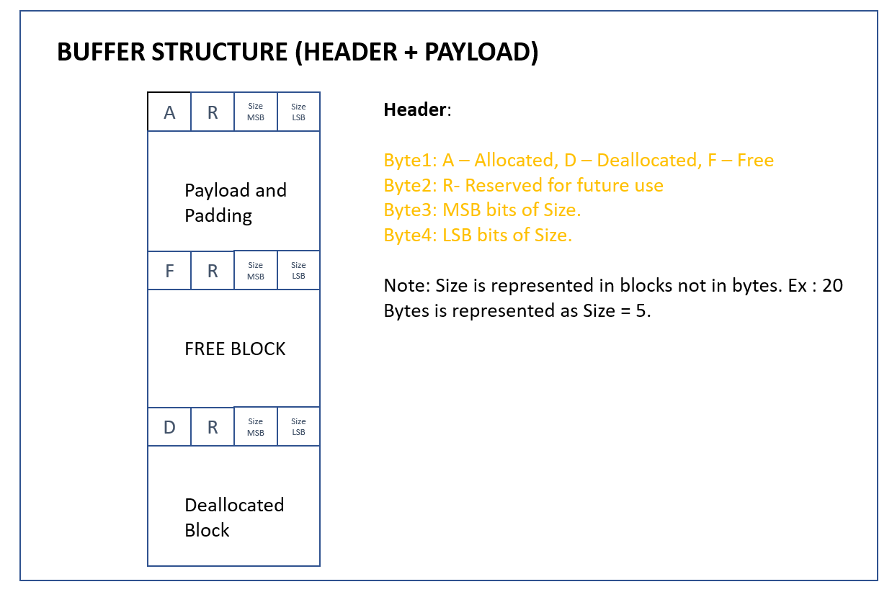
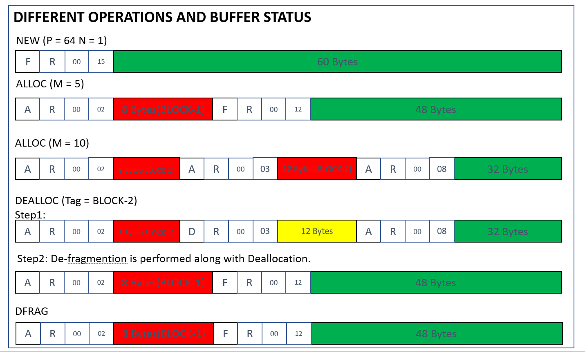

# memAllocatorService

# **Design Considerations**
1. Byte buffer of Size P*N is allocated with NEW operation.
2. Memory of M bytes can be allocated in Byte buffer with ALLOC operaton and returns TAG. (TAG: BLOCK-X)
   - Memory allocation follows 4 byte boundary i.e To Allocation of 1 byte results into allocation of 4 bytes. (1 byte + 3 bytes Padding).
   - Every allocation preceeds with 4 byte Header. Header 1st byte is type of block 'A'- Allocated, 'D' - Deallocated, 'F' - Free. 2nd byte of the header is 'R'-Reserved. 3rd and 4th byte is size of the block   
3. Deallocation is performed with DEALLOC operation with TAG. TAG is pointer pointing to memory block in Byte Buffer. Dealloc operation designed to realign contiguous DE-ALLOCATED blocks.
4. DEALLOC operation should Coalesce the blocks in both direction (DE-FRAGMENTATION)
5. SHOW operation returns current state of Byte buffer.
6. RESET operation resets Byte buffer and any allocations if present.
7. DEFRAG is performed along with DEALLOC operation.




# **Framework and Technologies used**

1. RESTful services are developed in Spring a Java based web framework.
2. Maven package manager is used to build jar file and manage dependency. 
3. For packaging JAR is chosen over to WAR to avoid dependency on web server. WAR is industry standard to deploy web applications.
4. POSTMAN or Curl can be used to test the REST endpoints. The endpoint details are given in following sections.


# **HOW TO RUN**
**To build:**

mvn clean;mavn install

**To run**

java -jar target/Memallocator-0.0.1-SNAPSHOT.jar


# **Operations**
The service supports a set of operations discussed below.

# **NEW**
```
curl --location --request POST 'localhost:8080/memalloc/new' --header 'Content-Type: application/json' --data-raw '{ "pageSize" : 1, "noOfPages" : 64 }'

Note: 
P = pageSize
N = noOfPages
```
```
Buffer of Size 64 Bytes created
```
# **ALLOC**

```
curl --location --request POST 'localhost:8080/memalloc/alloc' --header 'Content-Type: application/json' --data-raw '{ "mbytes" : 10 }'

Note:
M = mbytes
```

```
BLOCK-2
```

# **DEALLOC**

```
curl --location --request POST 'localhost:8080/memalloc/dealloc' --header 'Content-Type: application/json' --data-raw '{ "tag" : "BLOCK-2"}'
```
```
SUCCESS: Memory block deallocated successfull
```
# **SHOW**
```
curl --location --request GET 'localhost:8080/memalloc/show' 
```

```
{
"totalMemory":64,
"availableMemory":44,
"freeMemory":44,
"defaultHdrBlock":4,
"allocatedMemory":12,
"allocateHdrBlocks":4,
"deallocatedMemory":0,
"deallocatedHdrBlocks":0,
"buffer":"AR\u0000\u0003xxxxxxxxxxxxFR\u0000\u000Bffffffffffffffffffffffffffffffffffffffffffff"
}
```

# **RESET**
```
curl --location --request POST 'localhost:8080/memalloc/reset' 

```

```
RESET successful
```

# **DEFRAG**
```
 curl --location --request POST 'localhost:8080/memalloc/defrag'
 ```
 
 ```
 DEFRAG successful
 ```
 
 
